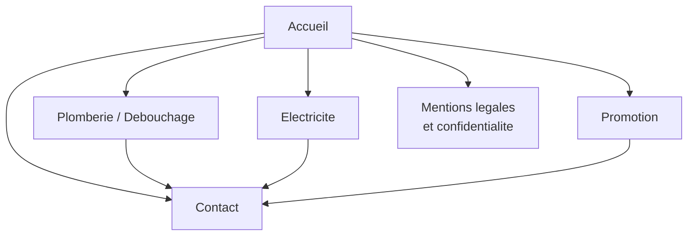

# Cahier des charges — Sanitaire Bavière SRL

---

## 1. Note d'intention

Salvatore P. est plombier depuis vingt ans, mais il n'a aucune présence en ligne. Ses clients le trouvent par le bouche-à-oreille et l'appellent directement. Le projet a deux buts : le rendre visible, et lui faire gagner du temps sur l'administratif, qui lui en prend beaucoup.

Quand je lui ai demandé ce qu'il attendait du site, il m'a donné trois réponses. Elles ont servi de base à tout le projet :

- « Un site pour que tout le monde puisse me voir, me faire connaître, présenter mon travail. »
- « Un espace admin pour centraliser tout ce qui touche à la paperasse et pouvoir gérer moi-même mon contenu. »
- « Centraliser mon planning de travail. »

La première demande concerne la visibilité, mais Salvatore précise qu'il veut surtout **montrer son travail**, pas parler de lui. Il ne veut pas d'une brochure commerciale. Ses photos de chantiers, son matériel et son expérience parlent pour lui, et le site doit d'abord les mettre en avant.

Les deux autres demandes viennent du même problème : ses informations sont éparpillées. Les devis sont dans un carnet ou dans ses mails, les rapports d'intervention n'existent pas, le planning est dans sa tête et les factures dans un classeur. Il suit les relances de mémoire. C'est pour ça qu'il trouve la paperasse « chronophage et pénible », et c'est aussi pour ça que les impayés sont difficiles à suivre.

### Un site vitrine ne suffit pas

Un site vitrine seul le rendrait visible, mais ne changerait rien à son quotidien. Le site public et le back-office sont donc pensés ensemble et utilisent la même base de données.

Concrètement, quand un visiteur envoie une demande de devis depuis le site, elle arrive dans le back-office et est liée à une fiche client. Salvatore peut ensuite en faire un devis, planifier l'intervention, rédiger le rapport puis établir la facture. Si la facture reste impayée, une relance est envoyée automatiquement. La demande de départ devient ainsi un dossier complet, qu'on peut suivre du début à la fin.

Ce suivi manque surtout avec les clients professionnels. Quand une société commande une intervention chez un de ses locataires, « les échanges passent par mail et le suivi devient problématique », explique Salvatore. Il ajoute que « le paiement des sociétés est le plus difficile à obtenir ». Les particuliers, eux, paient sur place en cash ou par Bancontact, sans difficulté. Le souci se situe donc du côté des sociétés, et vient surtout d'un manque de suivi : il faut pouvoir retrouver qui a commandé, chez quel locataire, ce qui a été fait, ce qui a été facturé et ce qui reste à payer.

### Ce que le projet doit lui apporter

À la fin du projet, Salvatore doit pouvoir :

- envoyer un lien à un client au lieu d'expliquer son métier au téléphone ;
- recevoir des demandes de devis complètes, directement depuis le site ;
- retrouver rapidement l'historique d'un client ou d'un immeuble ;
- passer du devis au rapport puis à la facture sans retaper les mêmes informations ;
- voir à tout moment les factures impayées ;
- modifier lui-même ses textes, ses photos et ses tarifs.

Le dernier point est important. Si un artisan ne peut pas mettre son site à jour seul, le contenu devient vite dépassé. Salvatore doit donc pouvoir gérer son contenu sans aide.

### L'image du site

Avec Salvatore, nous avons choisi la baseline « Si vous avez tout essayé, nous sommes là pour vous ». Elle correspond bien à sa situation : on l'appelle souvent après l'échec d'un autre dépanneur, ou après avoir essayé de régler le problème soi-même. Le site doit rester simple et direct : peu de texte, de vraies photos de chantiers, un numéro de téléphone bien visible et des tarifs affichés.

---

## 2. Présentation du client et de son activité

Sanitaire Bavière SRL est une société unipersonnelle dirigée par Salvatore P., plombier dans la région de Liège. Il travaille seul, sans employé ni sous-traitant, et fait surtout du dépannage. Les particuliers paient sur place, en cash ou par Bancontact ; les sociétés paient sur facture, par virement.

**Plomberie et débouchage.** C'est son activité principale. Il intervient sur tous les appareils sanitaires (évier, lavabo, douche, baignoire, sterput, WC), les siphons, les canalisations et les égouts. Il s'occupe aussi bien d'un simple bouchon que de cas où d'autres dépanneurs n'ont pas réussi.

**Électricité.** C'est une activité secondaire, avec moins de demandes. Elle permet surtout aux gérants d'immeubles de passer par une seule personne pour plusieurs types de travaux.

### Son matériel

Salvatore possède du matériel professionnel que beaucoup de dépanneurs n'ont pas :

- **Caméra d'inspection** : pour voir l'intérieur de la canalisation et trouver la cause du bouchon, au lieu de travailler à l'aveugle.
- **Sonde** : pour localiser précisément un blocage ou le tracé d'un tuyau.
- **Endoscopie de tuyauterie** : pour inspecter les réseaux difficiles d'accès.
- **Furet et appareils de débouchage** : adaptés à tous les cas, du siphon d'évier jusqu'à l'égout.

C'est grâce à ce matériel qu'il peut tenir la promesse de la baseline. Il faut donc le montrer sur le site, avec de vraies photos.

### Situation de départ

Aujourd'hui, Sanitaire Bavière n'a ni site, ni fiche en ligne, ni outil de gestion. Les nouveaux clients arrivent par le bouche-à-oreille ou appellent directement, et toute la partie administrative se fait à la main.

---

## 3. Analyse du besoin

L'entretien avec Salvatore a permis de relever cinq problèmes. Un seul concerne la recherche de clients, les quatre autres touchent à l'administratif. D'ailleurs, ce qui lui prend le plus de temps, c'est tout ce qu'il doit faire après une intervention.

### Personne ne le trouve en ligne

Salvatore a vingt ans d'expérience et un bon matériel de diagnostic, mais personne ne le sait. Quand un particulier a un évier bouché, il cherche un dépanneur sur son téléphone, et Salvatore n'apparaît pas dans les résultats. Il n'a pas non plus de support à montrer quand il veut se présenter à un gérant d'immeuble ou à une agence.

### Des clients qui ne voient pas tout le travail

Salvatore parle de « la manière dont le client le reçoit et estime son travail ». Le problème se pose surtout quand le client ne comprend pas ce qui a été fait, ni pourquoi le prix est celui-là. Le projet y répond à trois moments :

- **avant** l'intervention, avec des tarifs affichés sur le site, pour que le prix ne soit pas une surprise ;
- **pendant**, avec un devis écrit et validé quand c'est possible ;
- **après**, avec un rapport d'intervention et des photos qui montrent le travail réalisé.

Le rapport sert à deux choses : il rassure les particuliers, et il sert de justificatif si une société conteste une facture.

### Trop de temps passé sur l'administratif

C'est ce qui pèse le plus à Salvatore. Comme il travaille seul, il s'occupe à la fois des chantiers, de la gestion et de la partie commerciale. Aujourd'hui, il recopie plusieurs fois les mêmes informations : le nom du client dans le devis, puis dans le rapport, puis dans la facture. Dans le back-office, chaque document reprendra les données du précédent pour éviter ces doublons.

### Société, locataire et intervenant

Quand une société de gestion commande une intervention chez un locataire, trois parties sont concernées : celle qui commande, celle qui a le problème chez elle, et celle qui paie. Ce sont rarement les mêmes. Aujourd'hui, tout passe par mail et le suivi devient « problématique », selon Salvatore. Le back-office doit donc bien séparer le **donneur d'ordre**, à qui on envoie la facture, et le **lieu d'intervention**, où le travail est fait.

### Des impayés surtout du côté des sociétés

Salvatore le dit clairement : « le paiement des sociétés est le plus difficile à obtenir ». En général, le retard ne vient pas de la mauvaise foi du client. Souvent, la facture ne correspond pas au format de sa comptabilité, ou personne ne peut justifier la prestation en interne. Il faut donc des factures au format attendu par la comptabilité du client, et un rapport d'intervention joint à chaque facture.

---

## 4. Objectifs du projet

Le projet a quatre objectifs, chacun lié à un des problèmes décrits plus haut.

**Rendre Sanitaire Bavière visible et crédible.** Un site qui présente ses deux métiers, de vrais chantiers et des tarifs affichés.

**Faciliter les appels en urgence.** Le numéro de téléphone accessible en un clic depuis toutes les pages, et un site rapide à charger sur mobile.

**Centraliser la gestion.** Un seul outil pour gérer le contenu du site, les clients, les devis, le planning, les rapports et les factures.

**Mieux suivre les paiements.** Voir clairement les échéances, avec des relances envoyées automatiquement.

Le projet sera réussi si, à la livraison :

- le site est en ligne sur son propre nom de domaine (déjà acheté, car Salvatore voulait une adresse mail plus professionnelle) ;
- Salvatore a réussi à modifier seul un texte, une photo et un tarif ;
- un parcours complet a été testé, de la demande de devis jusqu'à la facture.

---

## 5. Cibles et parcours utilisateurs

Le site vise trois types de visiteurs : les particuliers, les locataires et les sociétés. Ils n'ont pas le même niveau d'urgence, ne prennent pas les décisions de la même façon et ne paient pas de la même manière. Le back-office, lui, n'a qu'un seul utilisateur.

**Marie, 42 ans, particulière en urgence.** Son évier est bouché depuis ce matin. Elle tape « débouchage Liège » sur son téléphone, ouvre trois résultats et appelle le premier qui affiche clairement un numéro. Elle ne lit pas les textes.
*Ce qu'elle attend :* un numéro cliquable visible tout de suite, une page qui charge vite, et la garantie que quelqu'un va vraiment venir chez elle.

**Thierry, 58 ans, particulier avec un projet.** Il doit refaire sa salle de bain et veut comparer avant de choisir. Il regarde le soir, sur son ordinateur, sans être pressé. Il se méfie des prix vagues.
*Ce qu'il attend :* des photos de vrais chantiers, des tarifs affichés et un formulaire pour demander un devis gratuit, sans engagement.

**Amina, 29 ans, locataire.** Sa douche refoule. Son agence lui a donné le numéro de Salvatore pour fixer un rendez-vous. Elle ne paie rien, mais c'est elle qui ouvre la porte.
*Ce qu'elle attend :* un numéro direct et une confirmation du rendez-vous. Dans le back-office, elle est enregistrée comme contact sur place, pas comme client facturé.

**Patrick, 47 ans, gestionnaire d'immeubles.** Il gère une trentaine d'appartements pour une régie liégeoise et commande plusieurs interventions par mois. Il a besoin de justificatifs pour sa comptabilité et pour les propriétaires. Il paie souvent en retard, parce qu'il manque une pièce à son dossier.
*Ce qu'il attend :* un seul interlocuteur, un devis écrit, un rapport avec photos et une facture au bon format pour son logiciel comptable. C'est le client qui rapporte le plus, mais aussi celui qui paie le plus difficilement. Le projet doit donc bien répondre à ses besoins.

**Salvatore, 51 ans, administrateur.** Il utilise le back-office le soir après ses chantiers, parfois sur son téléphone depuis sa camionnette. Il n'aime pas les outils compliqués : si le système lui demande plus d'efforts que sa méthode actuelle, il ne l'utilisera pas.
*Ce qu'il attend :* un écran d'accueil qui montre les urgences, des formulaires courts, et la possibilité de tout faire sur mobile.

Trois de ces cinq profils utilisent surtout leur téléphone. C'est pour ça que tout le projet est pensé d'abord pour le mobile.

---

## 6. Le site public

Le site compte cinq pages principales et deux pages légales. La structure est simple : toutes les pages utiles sont accessibles en un clic depuis l'accueil.

### Éléments communs à toutes les pages

- une barre de navigation avec le logo, les quatre rubriques et un bouton d'appel toujours visible ;
- sur mobile, un bouton d'appel fixé en bas de l'écran (lien `tel:`) ;
- une bannière de promotion sous la navigation, avec un lien « Voir plus » vers la page Promotion. Elle disparaît automatiquement quand il n'y a pas de promotion en cours ;
- un pied de page avec les coordonnées, le numéro d'entreprise, la zone d'intervention et les liens vers les pages légales ;
- un bandeau pour accepter ou refuser les cookies non essentiels.

### Accueil

Un visiteur en urgence doit pouvoir appeler sans rien lire. La page contient, dans l'ordre :

- la bannière de promotion ;
- une première section avec la baseline, une vraie photo et le numéro de téléphone en grand, cliquable ;
- trois ou quatre arguments courts : vingt ans de métier, région liégeoise, matériel de diagnostic, contact direct avec l'artisan ;
- deux cartes vers les pages Plomberie et Électricité ;
- une galerie de chantiers, gérée depuis le back-office ;
- une courte présentation du matériel ;
- un dernier rappel du numéro en bas de page.

### Plomberie et débouchage

C'est la page la plus importante, à la fois pour le référencement local et pour convaincre les visiteurs. Elle présente :

- les prestations : débouchage d'évier, de lavabo, de douche, de baignoire, de sterput et de WC, nettoyage de siphon, curage d'égouts, réparation de fuite, remplacement d'appareils sanitaires ;
- le matériel de diagnostic ;
- une grille de tarifs indicatifs, modifiable depuis le back-office ;
- une galerie avant / après ;
- quelques exemples d'intervention détaillés ;
- le formulaire de demande de devis gratuit.

Chaque exemple raconte un vrai chantier, étape par étape : le problème de départ, ce que Salvatore a constaté sur place, le matériel utilisé et le résultat, avec des photos. Par exemple, un WC qui se bouchait sans arrêt, où la caméra a montré des racines dans la canalisation. En lisant ces exemples, le visiteur peut retrouver son propre problème et voir que quelqu'un l'a déjà réglé. Il se rend aussi compte de ce qui est possible, alors qu'il ne l'imaginait pas forcément. C'est aussi le meilleur endroit pour montrer tout le matériel en situation, au lieu d'en faire une simple liste. Les exemples sont rédigés et mis en ligne depuis le back-office.

Le numéro d'urgence est affiché en haut et en bas de la page. *(À voir : mettre plutôt les tarifs sur l'accueil ?)*

### Électricité

Même structure, en plus court : prestations, tarifs indicatifs, quelques photos, un ou deux exemples d'intervention et lien vers le formulaire. Cette page montre aux clients qu'ils peuvent passer par Salvatore pour la plomberie comme pour l'électricité.

### Promotion

Tout le contenu de cette page est géré depuis le back-office : titre, description, conditions, dates de validité, visuel et bouton d'action. Quand aucune promotion n'est en cours, la bannière est masquée et la page affiche un simple message.

### Contact

La page reprend les coordonnées complètes avec le téléphone cliquable, le formulaire de contact et une illustration de la zone d'intervention autour de Liège. Un encart rappelle qu'en cas d'urgence, il vaut mieux appeler.

### Le formulaire de demande de devis

C'est ce formulaire qui relie le site au back-office : chaque envoi crée automatiquement une demande dans l'espace de gestion.

| Champ                     | Type                              | Obligatoire |
| ------------------------- | --------------------------------- | ----------- |
| Nom et prénom             | Texte                             | Oui         |
| Téléphone                 | Téléphone                         | Oui         |
| E-mail                    | E-mail                            | Non         |
| Type de demandeur         | Particulier / Locataire / Société | Oui         |
| Type de prestation        | Liste déroulante                  | Oui         |
| Adresse de l'intervention | Texte                             | Oui         |
| Description du problème   | Texte long                        | Oui         |
| Photos                    | 3 fichiers maximum                | Non         |
| Urgence                   | Case à cocher                     | Non         |
| Consentement              | Case à cocher                     | Oui         |

Le formulaire est protégé contre le spam, sans CAPTCHA gênant. Un message de confirmation s'affiche après l'envoi, et Salvatore reçoit une notification par e-mail. Le champ « Type de demandeur » permet de trier les demandes : celles des sociétés passent par un devis puis une facture, celles des particuliers peuvent être traitées directement.

---

## 7. Le back-office

C'est l'espace privé de Salvatore. On y accède avec un identifiant et un mot de passe, et il est construit avec Filament. Il compte sept modules, avec une règle simple : une information n'est saisie qu'une seule fois. Les modules suivent l'ordre du travail réel : demande, devis, intervention, rapport, facture.

### Tableau de bord

C'est le premier écran après la connexion. Il doit se lire en quelques secondes sur un téléphone et affiche les interventions du jour et de la semaine, les nouvelles demandes, les devis en attente de réponse, les factures en retard avec le montant total dû, et les relances prévues dans les sept jours.

### Contenu du site

C'est grâce à ce module que Salvatore peut gérer son site seul. Il peut y modifier les textes des pages, gérer ses photos (import, recadrage, légende, texte alternatif, classement par chantier), composer les galeries, rédiger des exemples d'intervention, changer les tarifs affichés, créer une promotion avec ses dates, et mettre à jour les réglages du site et les informations de référencement. La bannière de promotion s'affiche et disparaît toute seule selon les dates choisies.

### Clients et contacts

Ce module sert à gérer le cas société / locataire / intervenant. Il sépare trois choses :

- le **client** (particulier ou société), qui commande et reçoit la facture ;
- le **contact sur place**, souvent le locataire, avec son propre numéro ;
- l'**adresse d'intervention**, qui peut être différente de l'adresse de facturation.

Chaque fiche client contient ses coordonnées, son numéro d'entreprise et de TVA pour une société, ses adresses d'intervention et l'historique de ses devis, interventions, rapports et factures. On peut chercher un client par nom, téléphone ou adresse.

### Demandes et devis

Les demandes envoyées depuis le site arrivent ici, avec leur statut. Salvatore les associe à un client existant ou crée une nouvelle fiche sur le moment. Il prépare ensuite le devis : lignes de prestation, totaux calculés automatiquement, numéro et durée de validité. Le devis peut être exporté en PDF et envoyé par e-mail.

Quand un devis est accepté, Salvatore peut directement créer l'intervention dans le planning. Les lignes du devis sont reprises telles quelles dans la facture.

### Planning des interventions

Ce module répond à la demande « centraliser mon planning de travail ». Il propose une vue calendrier (jour, semaine ou mois) et une vue liste. Chaque intervention indique le client, le contact sur place, l'adresse, l'horaire, le type de prestation, le devis lié s'il y en a un, et des notes. Les statuts suivent ce qui se passe sur le terrain : planifiée, en cours, terminée, annulée, à replanifier. Les urgences sont mises en évidence. Sur téléphone, Salvatore peut appeler le contact sur place ou lancer l'itinéraire en un clic.

### Rapports d'intervention

Le rapport sert de preuve du travail réalisé. Il reprend automatiquement le client, l'adresse et la date, puis détaille ce qui a été constaté sur place, les travaux effectués, le matériel utilisé, les pièces et fournitures, les photos avant / après, la durée et d'éventuelles recommandations. Le client peut aussi signer sur l'écran.

Le rapport peut être exporté en PDF et joint à la facture. Si Salvatore le décide, ses photos peuvent aussi être ajoutées à la galerie du site, après avoir vérifié que rien ne permet d'identifier le client ou le lieu.

### Facturation

C'est le module le plus sensible. Une facture est créée à partir d'une intervention terminée ou d'un devis accepté, sans rien retaper. Les factures ont une numérotation qui se suit sans trou et calculent la TVA, avec les mentions propres aux travaux immobiliers. Elles s'exportent en PDF pour les particuliers, et dans le format structuré demandé par la comptabilité des sociétés. On peut suivre chaque facture de l'envoi au paiement, noter le mode et la date du paiement, créer des notes de crédit et consulter un tableau des impayés, classés par ancienneté.

### Relances

Ce module automatise une tâche que Salvatore trouve laborieuse.

| Déclencheur                      | Action                            | Destinataire        |
| -------------------------------- | --------------------------------- | ------------------- |
| Devis sans réponse après 7 jours | Rappel de devis                   | Client              |
| Échéance dépassée de 1 jour      | 1re relance, ton courtois         | Client              |
| Échéance dépassée de 15 jours    | 2e relance, rappel des conditions | Client              |
| Échéance dépassée de 30 jours    | Mise en demeure                   | Client et Salvatore |
| Intervention prévue le lendemain | Rappel de rendez-vous             | Contact sur place   |

Les messages peuvent être modifiés depuis le back-office. Pour un client en particulier, Salvatore peut mettre les relances en pause ou choisir de les valider une par une avant l'envoi. Toutes les relances sont enregistrées dans un historique, et aucune n'est envoyée pour une facture déjà payée.

---

## 8. Stack technique

| Couche               | Technologie  | Rôle                                                         |
| -------------------- | ------------ | ------------------------------------------------------------ |
| Framework applicatif | Laravel      | Base du site et du back-office, données, tâches planifiées, e-mails |
| Interactivité        | Livewire     | Composants dynamiques du site public sans application front séparée |
| Administration       | Filament     | Construction des modules du back-office                      |
| Mise en forme        | Tailwind CSS | Design du site public et cohérence visuelle                  |
| Base de données      | MySQL        | Contenus, clients, devis, interventions, rapports, factures  |

J'ai choisi **Laravel** avec **Filament** parce que Filament propose déjà tout ce qu'il faut pour un back-office : listes avec filtres, formulaires, relations entre les données, widgets. Je peux donc passer plus de temps sur la logique métier que sur l'interface d'administration. **Livewire** permet d'ajouter de l'interactivité sans créer une application front séparée. Enfin, Filament utilise déjà **Tailwind CSS**, ce qui aide à garder une cohérence visuelle entre le site et le back-office.
